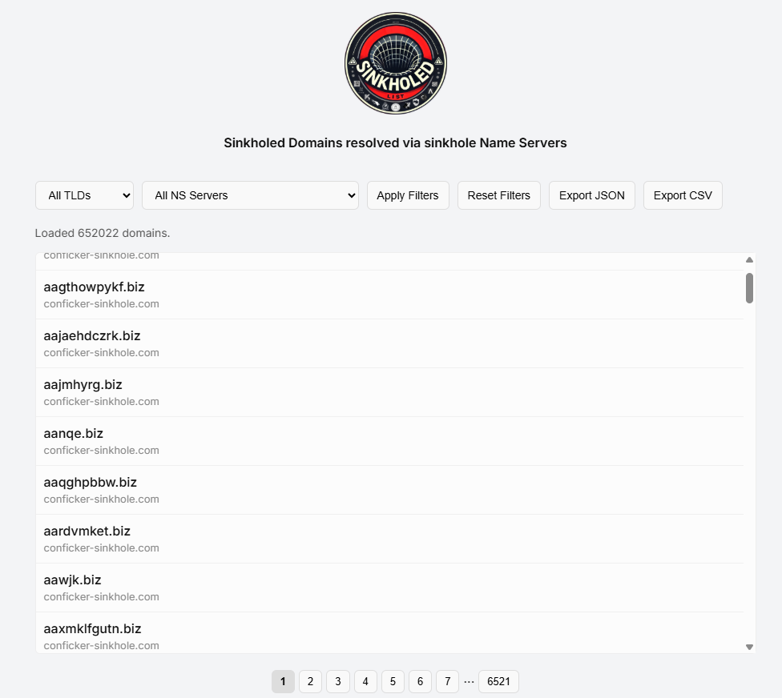

## sinkholed.github.io

Resolving domains from sinkhole Name Servers

Simple site to manually filter sinkholed domains:

the site is using this [list](https://github.com/mthcht/awesome-lists/blob/main/Lists/Domains/sinkholed_servers/sinkholed_domains.json) which is automatically updated with a github action

## URL parameters

With **[sinkholed.github.io](https://sinkholed.github.io)**, you can automate the retrieval of **sinkholed domains** by applying specific filters based on **Name Server (NS) names** and/or **Top-Level Domains (TLDs)** in the url

**Available Parameters in the url**:
- **`tld=`** → Filter by **Top-Level Domain (TLD)** (e.g., `.com`, `.net`, `.org`)
- **`ns=`** → Filter by a specific **Name Server (NS)**
- **`format=`** → Choose the output format: **`csv`** or **`json`**

**Example Usage**:
- Retrieve all `.net` domains associated with a specific sinkhole Name Server in JSON format: `curl -s https://sinkholed.github.io?tld=net&ns=conficker-sinkhole.com&format=json`
- Retrieve all `.com` sinkholed domains and get the output in CSV format: `https://sinkholed.github.io?tld=com&format=csv`
- Fetch only the domains linked to `ns1.fbi.seized.gov` (any TLD) in JSON format: `https://sinkholed.github.io?ns=ns1.fbi.seized.gov&format=json`

Allows the automated retrieval of sinkholed domain data based on your specific needs with a script using a headless browser!

## raw list
Complete lists are available and updated [here](https://github.com/mthcht/awesome-lists/blob/main/Lists/Domains/sinkholed_servers/)
